<sup>Jump to:&nbsp;&nbsp;&nbsp;[Table of Contents](#table-of-contents)&nbsp;&nbsp;&mdash;&nbsp;&nbsp;[Function Reference](#function-reference)&nbsp;&nbsp;&mdash;&nbsp;&nbsp;[dateTime function](#datetime)</sup>

# ezTime, an Arduino library for all of time&nbsp;<sup>*</sup>

&nbsp;&nbsp;&nbsp;&nbsp;&nbsp;&nbsp;&nbsp;&nbsp;&nbsp;&nbsp;&nbsp;&nbsp;&nbsp;&nbsp;&nbsp;&nbsp;&nbsp;&nbsp;&nbsp;&nbsp;&nbsp;&nbsp;&nbsp;&nbsp;&nbsp;&nbsp;&nbsp;&nbsp;&nbsp;&nbsp;&nbsp;&nbsp;&nbsp;&nbsp;&nbsp;&nbsp;&nbsp;&nbsp;&nbsp;&nbsp;&nbsp;&nbsp;&nbsp; <sup>written&nbsp;by&nbsp;Rop&nbsp;Gonggrijp</sup>

**ezTime &mdash; pronounced "Easy Time" &mdash; is a very easy to use Arduino time and date library that provides NTP network time lookups, extensive timezone support, formatted time and date strings, user events, millisecond precision and more.**

&nbsp;&nbsp;&nbsp;&nbsp;&nbsp;&nbsp;&nbsp;&nbsp;&nbsp;&nbsp;&nbsp;&nbsp;&nbsp;&nbsp;&nbsp;&nbsp;&nbsp;&nbsp;&nbsp;&nbsp;&nbsp;&nbsp;&nbsp;&nbsp;&nbsp;&nbsp;&nbsp;&nbsp;&nbsp;&nbsp;&nbsp;&nbsp;&nbsp;&nbsp;&nbsp;&nbsp;&nbsp;&nbsp;&nbsp;&nbsp;&nbsp;&nbsp;&nbsp;&nbsp;&nbsp;&nbsp;&nbsp;&nbsp;&nbsp;&nbsp;&nbsp;&nbsp;&nbsp;&nbsp;&nbsp;&nbsp;&nbsp;&nbsp;&nbsp;&nbsp;&nbsp;&nbsp;&nbsp;&nbsp;&nbsp;&nbsp;&nbsp;&nbsp;&nbsp;&nbsp;&nbsp;&nbsp;&nbsp;&nbsp;&nbsp;&nbsp;&nbsp;&nbsp;&nbsp;&nbsp;&nbsp;&nbsp;&nbsp;&nbsp;&nbsp;&nbsp;&nbsp;&nbsp;&nbsp;&nbsp;&nbsp;&nbsp;&nbsp;&nbsp;&nbsp;&nbsp;&nbsp;&nbsp;&nbsp;&nbsp;&nbsp;&nbsp;&nbsp;&nbsp;&nbsp;&nbsp;&nbsp;&nbsp;&nbsp;&nbsp;&nbsp;&nbsp;&nbsp;&nbsp;&nbsp;&nbsp;&nbsp;&nbsp;&nbsp;&nbsp;&nbsp;&nbsp;&nbsp;&nbsp;&nbsp;&nbsp;&nbsp;&nbsp;&nbsp;&nbsp;&nbsp;&nbsp;&nbsp;&nbsp;&nbsp; <sup>*&nbsp;limitations&nbsp;may&nbsp;apply,&nbsp;see&nbsp;"[2036&nbsp;and&nbsp;2038](#2036-and-2038)"&nbsp;chapter</sup>


&nbsp;

## A brief history of ezTime

I was working on [M5ez](https://github.com/ropg/M5ez), an interface library to easily make cool-looking programs for the "[M5Stack](http://m5stack.com/)" ESP32 hardware. The status bar of M5ez needed to display the time. That was all, I swear. I figured I would use [Time](https://github.com/PaulStoffregen/Time), Michael Margolis' and Paul Stoffregen's library to do time things on Arduino. Then I needed to sync that to an NTP server, so I figured I would use [NTPclient](https://github.com/arduino-libraries/NTPClient), one of the existing NTP client libraries. And then I wanted it to show the local time, so I would need some way for the user to set an offset between UTC and local time.

So far, so good.

Then I remembered how annoyed I always am when daylight savings time comes or goes, as I have to manually set some of my clocks such as the microwave oven, the clock in the car dashboard, etc etc. It's 2018, my clock should know about timezone rules. So I could get Jack Christensen's [Timezone library](https://github.com/JChristensen/Timezone). But it needs the timezone's rules, like *"DST goes into effect on the last Sunday in March at 02:00 local time"* told to it. I figured I would simply get this data from the internet and parse it.

Then I wanted 12 or 24 hour time displayed, and thought about various formats for date and time. Wouldn't it be nice to have some function to print formatted time like many programming languages offer?

Overlooking the battlefield after implementing some part of this, it seemed like there had to be a better way. Some way in which all this work would benefit more people. This is how ezTime &mdash; the project that was only going to take a few days &mdash; came to be.

## ezTime is ...

**self-contained**: It only depends on other libraries to get online, but then it doesn't need other libraries for NTP and timezone data lookups. (And even networking can be disabled completely if you have another source for time.)

**precise**: Unlike other libraries, ezTime does not throw away or mangle the fractional second information from the NTP server. An NTP request to pool.ntp.org only takes 40ms round-trip on home DSL these days, so adding sub-second precision to a time library makes sense. ezTime reads the fractional seconds and tries to account for network latency to give you precise time.

**backwards compatible**: Anything written for the existing Arduino time library will still work. You can set which timezone the sketch should be in, or have it be in UTC which is the default. But you can also set and express time referring to multiple timezones, all very easy and intuitive.

**eventful**: You can set events to have ezTime execute your own functions at a given time, and delete the events again if you change your mind.

**robust**: It doesn't fail if the timezone api goes away: it can use cached data, which ezTime can store in EEPROM (AVR Arduinos) or NVS (e.g. ESP32 through Preferences library).

**informative**: No need to guess while you're working on something, ezTime can print messages to the serial port at your desired level of detail, telling you about the timezone's daylight savings info it receives or when it gets an NTP update and by how much your internal clock was off, for instance.

**time-saving**: No more time spent on writing code to print date or time in some nicer way. Print things like "8:20 PM" or "Saturday the 23rd of August 2018" with ease. Prevent display-flicker with `minuteChanged()` and `secondChanged()` functions without storing any values to compare.

**multilingual**: Can display names of days and months in different languages. Easy to add your own language.

**small enough**: Works with all features and full debugging information on an old Arduino Uno with an Ethernet Shield, leaving 2/3 of RAM and even some of the flash for you to work with. Various `#define` options let you leave parts of the library out if you want to make it smaller: you can even leave out the networking altogether if you have a different time source.

**easy to use**: Don't believe it until you see it. Have a look at some of these examples to see how easy it is to use.

&nbsp;

### Timezones

(a complete sketch to show how simple it is)

```
#include <ezTime.h>
#include <WiFi.h>

void setup() {
	Serial.begin(115200);
	WiFi.begin("your-ssid", "your-password");

	waitForSync();

	Serial.println("UTC: " + UTC.dateTime());
	
	Timezone NewZealand;
	NewZealand.setLocation("Pacific/Auckland");
	Serial.println("New Zealand time: " + NewZealand.dateTime());
}

void loop() { }
```

```
UTC: Friday, 07-Sep-2018 11:25:10 UTC
New Zealand time: Friday, 07-Sep-2018 23:25:11 NZST
```

&nbsp;

### Formatted date and time

```
Serial.println("COOKIE:      " + UTC.dateTime(COOKIE));
Serial.println("IS8601:      " + UTC.dateTime(ISO8601));
Serial.println("RFC822:      " + UTC.dateTime(RFC822));
Serial.println("RFC850:      " + UTC.dateTime(RFC850));
Serial.println("RFC3339:     " + UTC.dateTime(RFC3339));
Serial.println("RFC3339_EXT: " + UTC.dateTime(RFC3339_EXT));
Serial.println("RSS:         " + UTC.dateTime(RSS));
Serial.println();
Serial.println("or like " + UTC.dateTime("l ~t~h~e jS ~o~f F Y, g:i A") );
```

```
COOKIE:      Saturday, 25-Aug-2018 14:23:45 UTC
IS8601:      2018-08-25T14:23:45+0000
RFC822:      Sat, 25 Aug 18 14:23:45 +0000
RFC850:      Saturday, 25-Aug-18 14:23:45 UTC
RFC3339:     2018-08-25T14:23:45+00:00
RFC3339_EXT: 2018-08-25T14:23:45.846+00:00
RSS:         Sat, 25 Aug 2018 14:23:45 +0000

or like Saturday the 25th of August 2018, 2:23 PM
```

&nbsp;

### milliseconds

```
for (int n = 0; n < 10; n++) {
	Serial.println(UTC.dateTime("l, d-M-y H:i:s.v T"));
}
```

```
Saturday, 25-Aug-18 14:32:53.282 UTC
Saturday, 25-Aug-18 14:32:53.283 UTC
Saturday, 25-Aug-18 14:32:53.284 UTC
Saturday, 25-Aug-18 14:32:53.285 UTC
Saturday, 25-Aug-18 14:32:53.287 UTC
Saturday, 25-Aug-18 14:32:53.290 UTC
Saturday, 25-Aug-18 14:32:53.293 UTC
Saturday, 25-Aug-18 14:32:53.297 UTC
Saturday, 25-Aug-18 14:32:53.300 UTC
Saturday, 25-Aug-18 14:32:53.303 UTC
```

> *This is on my ESP32. See how it fills up the serial buffer real fast at first, and then has to wait for the characters to be sent before it can return?*

&nbsp;

### Rich information and *... oh my just look at these NTP updates*

```
[...]
	setInterval(60);
	setDebug(INFO);
}

void loop() {
	events();
}
```

```
ezTime debug level set to INFO
Querying pool.ntp.org ... success (round trip 42 ms)
Received time: Saturday, 25-Aug-18 14:34:53.410 UTC (internal clock was 1 ms fast)
Querying pool.ntp.org ... success (round trip 43 ms)
Received time: Saturday, 25-Aug-18 14:35:53.480 UTC (internal clock was 1 ms slow)
Querying pool.ntp.org ... success (round trip 43 ms)
Received time: Saturday, 25-Aug-18 14:36:53.525 UTC (internal clock was 1 ms slow)
Querying pool.ntp.org ... success (round trip 36 ms)
Received time: Saturday, 25-Aug-18 14:37:53.573 UTC (internal clock was 4 ms slow)
Querying pool.ntp.org ... success (round trip 35 ms)
Received time: Saturday, 25-Aug-18 14:38:53.636 UTC (internal clock was spot on)
Querying pool.ntp.org ... success (round trip 32 ms)
Received time: Saturday, 25-Aug-18 14:39:53.674 UTC (internal clock was 1 ms slow)
```

&nbsp;

## Getting started

ezTime is an Arduino library. To start using it with the Arduino IDE:

* Choose Sketch -> Include Library -> Manage Libraries...
* Type `ezTime` into the search box.
* Click the row to select the library.
* Click the Install button to install the library.

in File -> Examples you will now see an ezTime heading down under "Examples from custom libraries". You can try running some of these examples to see if it all works. ezTime is made to be, as the name implies, quite easy to use. So you'll probably understand a lot of how things work from just looking at the examples. Now either just play with those and use the rest of this documentation only when you get stuck, or keep reading to see how things work in ezTime.

# &nbsp;

# ezTime User Manual

&nbsp;

## About this manual

### Semi-internal functions

Some functions are not necessarily useful for everyday users of this library, but might be useful to someone someday. For instance, this library checks with the NTP servers automatically, so there should be no need to ever "manually" get an NTP response. But the function to do that is still exposed to the user. Even some functions that have nothing to do with time, like `zeropad` are there for you to use, simply because they *might* be useful to someone, and the library needed them internally so they come at no extra cost in terms of size. In this manual, the names of these functions are printed in *italics* in their chapter headings, just to make it a easier for you to see which functions are core functionality and which are really not needed in everyday use.

### Specifying time

I hate documentation that still makes me reach for for the source code, so this manual supplies the function prototype with each function so you can see what types or arguments each function takes and what type the return value is. I took one shortcut though. A lot of functions allow you to specify a time. In the function prototype this looks like:

`time_t t = TIME_NOW, const ezLocalOrUTC_t local_or_utc = LOCAL`

Throughout this manual, we replace these two optional arguments in the function definitions with:

`TIME`

That's because the prior is just a little too long to be repeating a thousand times, and it also makes things look more complicated than they need to be. In most places where you specify a time in ezTime, you are most likely to mean "right now". This can be done by supplying no arguments at all, or `TIME_NOW`. You might make a number of requests in a row, and want to make sure that the time didn't change between them. No need to stick the time value in a variable. After you have made a call specifying no time (meaning `TIME_NOW`), you can specify `LAST_READ` to use the time from the exact moment you made that first call.

Otherwise, you can specify a `time_t` value, a well-known 32-bit signed integer way of specifying time in seconds elapsed since 00:00 Jan 1st 1970. If you specify a value other than `TIME_NOW` or `LAST_READ`, you can then specify whether you mean in UTC or local time, by following it with a second argument that is either `UTC_TIME` or `LOCAL_TIME`.

For example, if you have set up a timezone called Berlin, `Berlin.isDST(1536314299, UTC_TIME)` tells you whether Daylight Savings Time is in effect on that time, as seconds from 00:00 Jan 1st 1970 UTC, as opposed to the same amount of seconds from that time in Berlin (which would be the default). There will be some examples later on, showing you how to create and process such timestamps. Mostly though, you don't need specify anything at all because you just want something time-related about "right now".

> *Time-geek sidenote: ezTime does not have historical information about the daylight savings rules of the past or future, it only applies the rules it has now as if they also applied in the past or future. Check [here](https://www.timeanddate.com/) for historical records for timezones.*

&nbsp;

## How it all works

### What happens when you include the library

It all starts when you include the library with  `#include <ezTime.h>`. From that point forward you can use the functions in this manual to control the behaviour of ezTime. There will then also be a timezone object called `UTC`, which will be set as the default timezone for all commands that take an optional timezone prefix.

### No daemons here

It is important to understand what ezTime does NOT do. It does not somehow create a background process that keeps time, contacts servers, or whatever. The Arduino does the timekeeping for us with its `millis()` counter, which keeps the time in milliseconds since the Arduino started. All ezTime does when it synchronises time is to store a time (in seconds since 1970) and the position of the millis counter when that was. By seeing how much the millis counter has advanced and adding that starting point since 1970, ezTime tells time. But that internal clock isn't perfect, it may &mdash; very slowly &mdash; drift away from the actual time. That's why there is a periodic event set to synchronise the clock with the NTP server.

If you want events to happen &mdash; whether your own or the NTP updates that ezTime does periodically) &mdash; you should have `events()` in the main loop of your program.

### But I only just woke up !

Your code might call `Serial.println(UTC.dateTime());` to print a complete textual representation of date and time in the default format to the serial port. The library would find out that time had not been synchronised yet, and it would send off an NTP request to one of the NTP servers that `pool.ntp.org` resolves to. If your Arduino has just woken up, it probably hasn't gotten its DHCP information, or is not connected to the WiFi network just yet. And so the time lookup would fail and the call to `.dateTime` would return a String with the date and time just after midnight on the 1st of January 1970: the zero-point for the unix-style time counter used by ezTime. It would later correct to the real time, but that's not pretty.

Worse is when you set up a timezone for which you would like to retrieve the daylight savings rules from the server: it can't do that if the connection isn't up yet. So that's why there's a function called `waitForSync` that simply calls `events()` until it is synchronized (or until a set number of seconds passes, see below).

&nbsp;

## Setting and synchronising time

The NTP request from the scenario above failed because the network wasn't up yet, so the clock would still not be synchronised. A new request will be scheduled for 1801 seconds later, and sent when your code (or `waitForSync`) calls `events`.

&nbsp;

### timeStatus

`timeStatus_t timeStatus();`

Returns what state the clock is in. `timeStatus()` will return one of:

| timeStatus | meaning |
|----|----|
| `timeNotSet` | No NTP update or manual setting of the clock (by calling the `.setTime` method of a timezone) has taken place |
| `timeSet` | The clock should have the current time |
| `timeNeedsSync` | A scheduled NTP request has been due for more than an hour. (The time an update needs to be due before `timeNeedsSync` is set is configured by the `NTP_STALE_AFTER` define in the `ezTime.h` file.) |

&nbsp;

### waitForSync

`bool waitForSync(uint16_t timeout = 0);`

If your code uses timezones other than UTC, it might want to wait to initialise them until there is a valid time to see if the cached timezone definitions are still current. And if you are displaying a calendar or clock, it might look silly if it first says midnight on January 1st 1970 before showing the real time. `waitForSync` will wait for the network to connect, and then for the time to be synchronised before returning `true`. If you specify a timeout (in seconds), it will return after that many seconds even if the clock is not in sync yet, returning `false`. (ezTime error `TIMEOUT`, see the [chapter on error and debug messages](#errors-and-debug-information) further down)

&nbsp;

### *setServer and setInterval*

`void setServer(String ntp_server = NTP_SERVER);`

`void setInterval(uint16_t seconds = 0);`

By default, ezTime is set to poll `pool.ntp.org` about every 30 minutes. These defaults should work for most people, but you can change them by specifying a new server with `setServer` or a new interval (in seconds) with setInterval. If you call setInterval with an interval of 0 seconds or call it as `setInterval()`, no more NTP queries will be made.

&nbsp;

### *updateNTP*

`void updateNTP();`

Updates the time from the NTP server immediately. Will keep retrying about every 30 minutes  (defined by `NTP_RETRY` in `ezTime.h`), will schedule the next update to happen after the normal interval.

&nbsp;

### *lastNtpUpdateTime*

`time_t lastNtpUpdateTime();`

Will return the last time the time was successfully synchronized with the NTP server.

&nbsp;

### *queryNTP*

`bool queryNTP(String server, time_t &t, unsigned long &measured_at);`

This will send a single query to the NTP server your specify. It will put, in the `t` and `measured_at` variables passed by reference, the UTC unix-time and the `millis()` counter at the time the exact second happened. It does this by subtracting from `millis()` the fractional seconds received in the answer, as well as half the time it took to get an answer. This means it assumes the network delay was symmetrical, meaning it took just as long for the request to get to the server as for the answer to get back.

If the time server answers, `queryNTP` returns `true`. If `false` is returned, `error()` will return either `NO_NETWORK` (if the WiFi is not connected) or `TIMEOUT` if a response took more than 1500 milliseconds (defined by `NTP_TIMEOUT` in `ezTime.h`).

Note that this function is used internally by ezTime, but does not by itself set the time ezTime keeps. You will likely never need to call this from your code.

&nbsp;

## Timezones

> *If only it was as uncomplicated as this map suggests. Every band is actually made up of countries that all change to their Daylight Saving Time on different dates, and they even frequently change the rules for when that happens.*

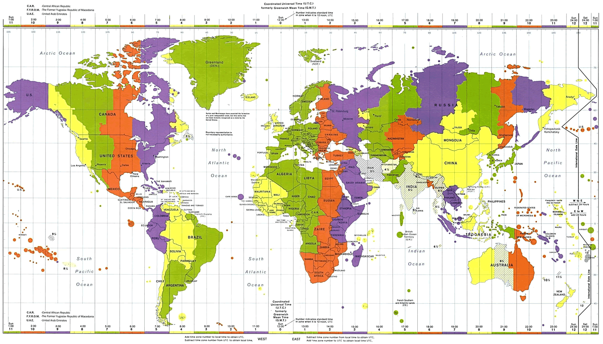

Timezones in ezTime are objects. They can be created with `Timezone yourTZ`, where `yourTZ` is the name you choose to refer to the timezone. In this manual, this name will be used from now on. But you can naturally choose any name you want.

Internally, ezTime stores everything it knows about a timezone as two strings. One is the official name of the timezone in "Olson" format (like `Europe/Berlin`). That name is used to then update when needed all the other information needed to represent time in that timezone. This is in another string, in so-called "posix" format. It's often a little longer and for Berlin it is `CET-1CEST,M3.5.0,M10.5.0/3`. The elements of this string have the following meanings:

| Element | meaning |
| ---- | ---- |
| `CET` | Name of timezone in standard time (CET = Central European Time in this case.)
| `-1` | Hours offset from UTC, meaning subtract one hour from this time to get to UTC. (Note offset is often written elsewhere the other way around (so +1 in this case), just to confuse things.) Could also specify minutes, like `-05:30` for India. |
| `CEST` | Name of timezone in Daylight Saving  Time (DST), CEST stands for Central European Summer Time |
| `,M3` | DST starts in March |
| `.5` | On the last occurrence of
| `.0` | a Sunday |
| `/2` | at 02:00 local time |
| `,M10` | DST ends in October |
| `.5` | on the last occurrence of |
| `.0` | a Sunday |
| `/3` | at 03:00 local time |

&nbsp;

### setDefault

`void setDefault()`&nbsp;&nbsp;&nbsp;&nbsp;&mdash;&nbsp;**MUST** be prefixed with name of a timezone, like `yourTz.setDefault()`

`#include <ezTime.h>` includes the library, creates `ezTime` object and `UTC` instance of `Timezone` class, as well as `defaultTZ`, which is a reference to UTC unless you set it to another timezone by calling `yourTZ.setDefault()`. ezTime is compatible with the classic Arduino time library, and thus you can call various functions in the root namespace like `hour()` and `minute()` &mdash; without a timezone in front. They are interpreted as if passed to the default timezone. So if you have existing code, just setting up a timezone and making it the default should cause that code to work as if the time was set in local time. New code that depends on ezTime should probably explicitly mention the timezone.

&nbsp;

### setPosix

`bool setPosix(String posix)`&nbsp;&nbsp;&nbsp;&nbsp;&mdash;&nbsp;**MUST** be prefixed with name of a timezone, like `India.setPosix("IST-5:30")`

Allows you to directly enter the posix information for a timezone. For simple timezones, you could set things up manually. For example for India, a mere

```
Timezone India;
India.setPosix("IST-5:30");
Serial.println(India.dateTime());
```

is enough, because the time in India doesn't go back and forth with the coming and going of Daylight Savings Time (even though the half hour offset to UTC is pretty weird.)

&nbsp;

### getPosix

`String getPosix()`&nbsp;&nbsp;&nbsp;&nbsp;&mdash;&nbsp;**MUST** be prefixed with name of a timezone, like `India.getPosix()`

`getPosix` does what you would expect and simply returns the posix string stored in ezTime for a given timezone.

&nbsp;

### isDST

`bool isDST(TIME);`&nbsp;&nbsp;&nbsp;&nbsp;&mdash;&nbsp;Assumes default timezone if no timezone is prefixed

Tells you whether DST is in effect at a given time in this timezone. If you do not provide arguments, it's interpreted as 'right now'. You can also specify a time (in seconds since 1970, we'll get back to that) in the first argument. If you want to know a certain time in UTC in within the DST windown in a given timezone you can set the second argument to `false`, otherwise it is assumed you are asking about a time expressed as local time.

&nbsp;

### getTimezoneName

`String getTimezoneName(TIME);`&nbsp;&nbsp;&nbsp;&nbsp;&mdash;&nbsp;Assumes default timezone if no timezone is prefixed

Provides the current short code for the timezone, like `IST` for India, or `CET` (during standard time) or `CEST` (during Daylight Saving Time) for most of Europe.

&nbsp;

### getOffset

`int16_t getOffset(TIME)`&nbsp;&nbsp;&nbsp;&nbsp;&mdash;&nbsp;Assumes default timezone if no timezone is prefixed

Provide the offset from UTC in minutes at the indicated time (or now if you do not specify anything). The offset here is in the same direction as the posix information, so -120 means 2 hours east of UTC.

&nbsp;

### setLocation

`boolsetLocation(String location = "")`&nbsp;&nbsp;&nbsp;&nbsp;&mdash;&nbsp;**MUST** be prefixed with name of a timezone

With `setLocation` you can provide a string to do an internet lookup for a timezone. The string can either be an Olson timezone name, like `Europe/Berlin` (or some unique part of such a name). ([Here](https://en.wikipedia.org/wiki/List_of_tz_database_time_zones) is a complete list of these names.) Or it can be a two-letter country code for any country that does not span multiple timezones, like `NL` or `DE` (but not `US`). After the information is retrieved, it is loaded in the current timezone, and cached if a cache is set (see below). `setLocation` will return `false` (Setting either `NO_NETWORK`, `DATA_NOT_FOUND` or `SERVER_ERROR`) if it cannot get timezone information.

If you provide no location ( `YourTZ.setLocation()` ), ezTime will attempt to do a GeoIP lookup to find the country associated with your IP-address. If that is a country that has a single timezone, that timezone will be loaded, otherwise a `SERVER_ERROR` ("Country Spans Multiple Timezones") will result.

In the case of `SERVER_ERROR`, `errorString()` returns the error from the server, which might be "Country Spans Multiple Timezones", "Country Not Found", "GeoIP Lookup Failed" or "Timezone Not Found".

If you execute multiple calls to `setLocation`, make sure they are more than 3 seconds apart, because the server will not answer if calls from the same IP come within 3 seconds of one another (see below).

&nbsp;

### timezoned.rop.nl

`timezoned.rop.nl` is ezTime's own timezone service that it connects to. It is a simple UDP service that gets a packet on UDP port 2342 with the request, and responds with a packet that holds the POSIX information for that timezone (after `OK `) or the error (after `ERR `). It will only respond to the same IP-number once every three seconds to prevent being used in DDoS attacks.

The service has the potential of seeing which IP-numbers use ezTime and what timezone data they request. Any GeoIP lookups are done against a local database, no third parties are involved. The service does not keep logfiles unless something is wrong and needs debugging. In such a case any logfiles will be deleted after work is done, but within 48 hours at the latest.

Data has never been used for any other purposes than debugging, nor is any other use envisioned in the future.

The code for the timezoned server is included in the server directory of the library repository, in case someone wnats to know how that works or insists on running a timezone information server themselves. Be aware that it is a bit of an ugly hack at the time of writing this... 

&nbsp;

### Timezone caching, EEPROM or NVS

If you use setLocation, the timezone information comes from timezoned.rop.nl. I'll try to keep that running as stable as possible, but if that service has a problem, your Arduino would not know what time it is anymore.

That is why you can create a place for ezTime to store the data about the timezone. That way, it doens't need to get the information anew every time the Arduino boots. You can store the cache for a timezone in EEPROM (the default) or NVS.

If your code says `tz.setCache(0)` it will try to read and interpret the data from EEPROM location 0 immediately, and it will store any future updated data it receives for that timezone there. Some programs might want to just start up in whatever timezone the user has set before, so they just call `yourTZ.setCache(0)` when they start and `yourTZ.setLocation` when the user goes to settings to select a different timezone. Simple programs might do:

```
if (!someTZ.setCache(0)) someTZ.setLocation("Europe/Berlin");
```

To only get the timezone data from the internet when the cache is empty or outdated and use the cached information all the other times. (Note that if you change the city in the above example it will still get the Berlin information from the cache and not execute the `setLocation` until you run `someTZ.clearCache()`.

&nbsp;

### setCache

`bool setCache(int16_t address)`&nbsp;&nbsp;&nbsp;&nbsp;&mdash;&nbsp;**MUST** be prefixed with name of a timezone

If your ezTime is compiled with `#define EZTIME_CACHE_EEPROM` (which is the default), you can supply an EEPROM location. A single timezone needs 50 bytes to cache. The data is written in compressed form so that the Olson and Posix strings fit in 3/4 of the space they would normally take up, and along with it is stored a checksum, a length field and a single byte for the month in which the cache was retrieved, in months after January 2018.

`bool setCache(String name, String key)`&nbsp;&nbsp;&nbsp;&nbsp;&mdash;&nbsp;**MUST** be prefixed with name of a timezone

On ESP32 and possibly other platforms, there is an emulation for the EEPROM in flash, but there is also a nicer mechanism that stores keys and values in flash. You can use this by enabling `#define EZTIME_CACHE_NVS` in `ezTime.h` You can then supply a section name and a key to serve as the cache storage location for a given timezone.

&nbsp;

### clearCache

`void clearCache(bool delete_section = false)`&nbsp;&nbsp;&nbsp;&nbsp;&mdash;&nbsp;**MUST** be prefixed with name of a timezone

Clears the cache for a timezone. If you use EEPROM, the bytes are overwritten with zeroes, if you use NVS, the key is deleted. If you provide the argument `true` using NVS the entire section is deleted. Do this only if that section does not contain anything else that you want to keep.

&nbsp;

### Crazy timezones

#### Chatham Islands and Nepal

The Chatham Islands are in Pacific about 800 kilometres east of New Zealand. Some 600 people live there, but they have their own timezone (UTC+12:45). It is one of only three time zones with a 45-minute offset from UTC, the others being Nepal Time (UTC+05:45) and the unofficial Australian Central Western Time (UTC+08:45). These timezones work  fine in ezTime.

#### Morocco

Morocco goes on and off Daylight Saving Time twice per year. This currently breaks ezTime as our parser can only handle one DST period per year. Fortunately they will stop doing this in 2020: the Moroccans probably got tired of all the clocks that did not adjust properly.

&nbsp;

## Getting date and time

### dateTime

`String dateTime(TIME, String format = DEFAULT_TIMEFORMAT);`<br>
&nbsp;&nbsp;&nbsp;&nbsp;&mdash;&nbsp;Assumes default timezone if no timezone is prefixed

We'll start with one of the most powerful functions of ezTime. With `dateTime` you can represent a date and/or a time in any way you want. You do this in the same way you do in many programming languages: by providing a special formatting string. Many characters in this string have special meanings and will be replaced. What this means is that `UTC.dateTime("l, d-M-y H:i:s.v T")` might return `Saturday, 25-Aug-18 14:32:53.282 UTC`. Below is the list of characters and what they are replaced by. Any characters not on this list are simply not replaced and stay as is. See the last two entries for a way to use characters on this list in your string.

| char | replaced by
| ----- | :-----
| `d` | Day of the month, 2 digits with leading zeros
| `D` | First three letters of day in English, like `Tue`
| `j` | Day of the month without leading zeros
| `l` | (lowercase L) Day of the week in English, like `Tuesday`
| `N` | // ISO-8601 numeric representation of the day of the week. (1 = Monday, 7 = Sunday)
| `S` | English ordinal suffix for the day of the month, 2 characters (st, nd, rd, th)
| `w` | Numeric representation of the day of the week (0 = Sunday)
| `F` | A month's name, such as `January`
| `m` | Numeric representation of a month, with leading zeros
| `M` | Three first letters of a month in English, like `Apr`
| `n` | Numeric representation of a month, without leading zeros
| `t` | Number of days in the given month
| `Y` | A full numeric representation of the year, 4 digits
| `y` | Last two digits of the year
| `a` | am or pm
| `A` | AM or PM
| `g` | 12-hour format of an hour without leading zeros
| `G` | 24-hour format of an hour without leading zeros
| `h` | 12-hour format of an hour with leading zeros
| `H` | 24-hour format of an hour with leading zeros
| `i` | Minutes with leading zeros
| `s` | Seconds with leading zero
| `T` | abbreviation for timezone, like `CEST`
| `v` | milliseconds as three digits
| `e` | Timezone identifier (Olson name), like `Europe/Berlin`
| `O` | Difference to Greenwich time (GMT) in hours and minutes written together, like `+0200`. Here a positive offset means east of UTC.
| `P` | Same as O but with a colon between hours and minutes, like `+02:00`
| `Z` | Timezone offset in seconds. West of UTC is negative, east of UTC is positive.
| `z` | The day of the year (starting from 0)
| `W` | ISO-8601 week number. See right below for explanation link.
| `X` | ISO-8601 year for year-week notation as four digit year. Warning: Not guaranteed to be same as current year, may be off by one at start or end of year. See [here](https://en.wikipedia.org/wiki/ISO_week_date)
| `B` | One-letter military code for the timezone, or `?` if the offset is not a whole number of hours.
| `\` | Not printed, but escapes the following character, meaning it will not be replaced. But inserting a backslash in the string means you have to supply two backslashes `\\` to be interpreted as one.
| `~` | (tilde) Same as backslash above, except easier to insert in the string. Example: `~t~h~e` will print the word `the` in the string. Letters should be escaped even if they are not on the list because they may be replaced in future versions.

So as an example: `UTC.dateTime("l ~t~h~e jS ~o~f F Y, g:i A")` yields date and time in this format: `Saturday the 25th of August 2018, 2:23 PM`.

&nbsp;

### Built-in date and time formats

There are built-in values to specify some standard date and time formats. For example: `UTC.dateTIme(RSS)` (without quotes around RSS) returns something like `Sat, 25 Aug 2018 14:23:45 +0000`. Here's a list of all these built in format abbreviations.

| name        | formatted date and time
|:------|:------|
| ATOM        | 2018-08-25T14:23:45+00:00	
| COOKIE      | Saturday, 25-Aug-2018 14:23:45 UTC
| IS8601      | 2018-08-25T14:23:45+0000
| RFC822      | Sat, 25 Aug 18 14:23:45 +0000
| RFC850      | Saturday, 25-Aug-18 14:23:45 UTC
| RFC1036     | Sat, 25 Aug 18 14:23:45 +0000	
| RFC1123     | Sat, 25 Aug 2018 14:23:45 +0000	
| RFC2822     | Sat, 25 Aug 2018 14:23:45 +0000	
| RFC3339     | 2018-08-25T14:23:45+00:00
| RFC3339_EXT | 2018-08-25T14:23:45.846+00:00
| RSS         | Sat, 25 Aug 2018 14:23:45 +0000
| W3C         | 2018-08-25T14:23:45+00:00	
| ISO8601_YWD | 2018-W34-5

&nbsp;

### Time and date as numbers

`time_t now()`&nbsp;&nbsp;&nbsp;&nbsp;&mdash;&nbsp;Assumes default timezone if no timezone is prefixed

Returns the current time in seconds since midnight Jan 1st 1970 in the timezone specified.

`uint8_t hour(TIME)`<br>
`uint8_t hourFormat12(TIME)`<br>
`uint8_t minute(TIME)`<br>
`uint8_t second(TIME)`<br>
`uint16_t ms(TIME)`<br>
`uint8_t day(TIME)`<br>
`uint8_t weekday(TIME)`<br>
`uint8_t month(TIME)`<br>
`uint16_t year(TIME);`

These functions return the various elements of date or time for right now (no arguments) or for a given time in seconds sinds 1970. `weekday` returns a number starting with 1 for Sunday. `hourFormat12` does hours from 1 to 12.

If you want to compare you can use compiler defines in all capital letters for names of days and months, like:

```
if (weekday() == TUESDAY) Serial.print("Tuesday!!");
```

```
if (month() == FEBRUARY && day() == 14) Serial.print("Valentine's day!");
```

&nbsp;

`bool isAM(TIME)`&nbsp;&nbsp;&nbsp;&nbsp;&mdash;&nbsp;Both assume default timezone if no timezone is prefixed<br>
`bool isPM(TIME)`

These will tell if it is before or after noon for a given `TIME`, return `true` or `false`.

&nbsp;

`uint16_t dayOfYear(TIME)`&nbsp;&nbsp;&nbsp;&nbsp;&mdash;&nbsp;Assumes default timezone if no timezone is prefixed

Returns how many days have passed in the year. January 1st returns 0,

&nbsp;

### *weekISO and yearISO*

`uint8_t weekISO(TIME)`<br>`uint16_t yearISO(TIME)`&nbsp;&nbsp;&nbsp;&nbsp;&mdash;&nbsp;Both assume default timezone if no timezone is prefixed

These functions return the ISO-8601 Year-week notation year and week number. Note that the year returned here can differ one from the current year at the first or last days or the year. ISO-8601 defines the first year of the week as the first week that has a Thursday in it. Meaning the start of the ISO-year can be a few days earlier (in December) or a few days later (in January).

&nbsp;

### *militaryTZ*

`String militaryTZ(TIME)`&nbsp;&nbsp;&nbsp;&nbsp;&mdash;&nbsp;Assumes default timezone if no timezone is prefixed

Returns the one-letter military code for the timezone. See [here](https://www.timeanddate.com/time/zones/military) for details. If the offset for the current timezone is not a whole number of hours, "?" is returned.

&nbsp;

### secondChanged and minuteChanged

`bool secondChanged()`

`bool minuteChanged()`

You might have code that put the time on a display in some really nice-looking format, using `dateTime`. The main loop wants to keep the time updated, but not every time the main loop runs, because it would cause the display to flicker. The classic solution for this is to store the time, recreate the string every time and compare to see if it changed. With `secondChanged` and `minuteChanged` you can just write something like:

```
if (minuteChanged()) WriteToSomeDisplay(UTC.dateTime("H:i"));
```

&nbsp;

### names of days and months

`String dayStr(const uint8_t day)`

`String dayShortStr(const uint8_t day)`

`String MonthStr(const uint8_t month)`

`String MonthShortStr(const uint8_t month)`

These functions will take a numeric argument and convert it to the name of the day or the name of the months. These functions do not tell you the current day or month, they just convert the number `1` to `Sunday`, `Sun`, `January` or `Jan` respectively. They are here to be compatible with the classic Time library. The [`dateTime`](#datetime) function can provide all sorts of strings and is much more flexible.

&nbsp;

### different languages

If you edit the ezTime.h file in the library directory and set the EZTIME_LANGUAGE define to NL or DE, you will get the names of the months and days in Dutch or German respectively. The functions that return these names are separated out in files in the `src/lang` directory, the files there will show you what languages are currently supported. If you add a file in this directory you will add a language, it is that easy. Please submit the files you make via a pull request so others can use ezTime in their own language too.

&nbsp;

## Events

### events

`void events()`

This is what your loop functions should call if they want events executed. This includes user-set events (see below) and the NTP updates that ezTime does periodically. `events()` also calls the Arduino function `yield()`, so you do not need to call that anymore (but once more doesn't hurt).

&nbsp;

### setEvent

`uint8_t setEvent(void (*function)(), TIME)`&nbsp;&nbsp;&nbsp;&nbsp;&mdash;&nbsp;Both assume default timezone if no timezone is prefixed

`uint8_t setEvent(void (*function)(), uint8_t hr, uint8_t min, uint8_t sec,`<br>&nbsp;&nbsp;&nbsp;&nbsp;&nbsp;&nbsp;&nbsp;&nbsp;&nbsp;&nbsp;`uint8_t day, uint8_t mnth, uint16_t yr)`


With ezTime, you can set your own events to run at a specified time. Simply run `setEvent` specifying the name of the function you would like to call (without the brackets) and a time you would like to call it. The first time `events` runs and notices that it is at or after the time you specified it will run and then delete the event. If you want an event to recur, simply set a new event in the function that gets called. You can have a maximum of 8 events by default (easily changed by changing `MAX_EVENTS` in `ezTime.h`). ezTime uses one event internally to trigger the next NTP update.

`setevent` returns an 8-bit event handle between 1 and MAX_EVENTS which you can store in a variable and use to delete the event with `deleteEvent` should your program need to. Zero is returned and the error `TOO_MANY_EVENTS` set if there are no more free slots for your new event.

&nbsp;

### deleteEvent

`void deleteEvent(uint8_t event_handle)`

Deletes the event with the handle as returned by `setEvent`.

`void deleteEvent(void (*function)())`

Buy you can also call `deleteEvent` with the name of the function (again without the brackets) to delete all events that would have executed that function.

&nbsp;


## Setting date and time manually


### setTime

`void setTime(time_t t, uint16_t ms = 0)`&nbsp;&nbsp;&nbsp;&nbsp;&mdash;&nbsp;Both assume default timezone if no timezone is prefixed

`void setTime(uint8_t hr, uint8_t min, uint8_t sec,`<br>&nbsp;&nbsp;&nbsp;&nbsp;&nbsp;&nbsp;&nbsp;&nbsp;&nbsp;&nbsp;`uint8_t day, uint8_t mnth, uint16_t yr)`

`setTime` pretty much does what it says on the package: it sets the time to the time specified, either as separate elements or as a time_t value in seconds since Jan 1st 1970. If you have another source of time  &mdash; say, a GPS receiver &mdash; you can use `setTime` to set the time in the UTC timezone. Or you can set the local time in any other timezone you have set up and ezTime will set its internal offset to the corresponding time in UTC so all timezones stay at the correct time.

It's important to realise however that NTP updates will still become due and when they do time will be set to the time returned by the NTP server. If you do not want that, you can turn off NTP updates with `setInterval()`. If you do not use NTP updates at all and do not use the network lookups for timezone information either, you can compile ezTime with no network support by commenting out `#define EZTIME_NETWORK_ENABLE` in the `ezTime.h` file, creating a smaller library.

### Alternate sources of time

If your time source is not NTP, the way to update time is to create a user function that gets the time from somewhere and then sets the clock with `setTime` and then schedules the next time it synchronises the clock with `setEvent`. This way you have full flexibility: you can schedule the next update sooner if this update fails, for instance. Remember to turn off NTP updates if you want your new time to stick.

## Working with time values

### *breakTime*

`void breakTime(time_t time, tmElements_t &tm)`

If you create a `tmElements_t` structure and pass it to `breakTime`, it will be filled with the various numeric elements of the time value specified. tmElements_t looks as follows:

```
typedef struct  {
	uint8_t Second;
	uint8_t Minute;
	uint8_t Hour;
	uint8_t Wday;   // day of week, sunday is day 1
	uint8_t Day;
	uint8_t Month;
	uint8_t Year;   // offset from 1970;
} tmElements_t;
```

Meaning this code would print the hour:

```
tmElements_t tm;
breakTime(UTC.now(), tm);
Serial.print(tm.Hour);
```

But `Serial.println(UTC.hour())` also works and is much simpler. `breakTime` is used internally and is a part of the original Time library, so it is available for you to use. Mind that the year is a single byte value, years since 1970.

&nbsp;

### makeTime

`time_t makeTime(tmElements_t &tm);`

This does the opposite of `breakTime`: it takes a `tmElements_t` structure and turns it into a `time_t` value in seconds since Jan 1st 1970.

`time_t makeTime(uint8_t hour, uint8_t minute, uint8_t second,`<br>&nbsp;&nbsp;&nbsp;&nbsp;&nbsp;&nbsp;&nbsp;&nbsp;&nbsp;&nbsp;`uint8_t day, uint8_t month, int16_t year);`

This version takes the various numeric elements as arguments. Note that you can pass the year both as years since 1970 and as full four digit years.

&nbsp;

### *makeOrdinalTime*

`time_t makeOrdinalTime(uint8_t hour, uint8_t minute, uint8_t second,`<br> &nbsp;&nbsp;&nbsp;&nbsp;&nbsp;&nbsp;&nbsp;&nbsp;&nbsp;&nbsp;`uint8_t ordinal, uint8_t wday, uint8_t month, int16_t year);`

With `makeOrdinalTime` you can get the `time_t` value for a date written as "the second Tuesday in March". The `ordinal` value is 1 for first, 2 for second, 3 for third, 4 for fourth and either 5 or 0 for the last of that weekday in the month. `wday` is weekdays starting with Sunday as 1. You can use the names of ordinals, months and weekdays in all caps as they are compiler defines. So the following would find the `time_t` value for midnight at the start of the first Thursday of the year in variable `year`.

```
makeOrdinalTime(0, 0, 0, FIRST, THURSDAY, JANUARY, year)
```

> *This is actually a fragment of ezTime's own code, as it can print ISO week numbers and the first ISO week in a year is defined as the week that has the first Thursday in it.*

&nbsp;

### *compileTime*

`time_t compileTime(String compile_date = __DATE__, String compile_time = __TIME__);`

You can ignore the arguments above and just say `compileTime()`. Returns the time value for when you compiled your sketch. You can check out the "NoNetwork" example with this library to see it in use: it makes your Arduino pretend to know what time it is.

&nbsp;

### *tzTime*

`time_t tzTime(TIME)`&nbsp;&nbsp;&nbsp;&nbsp;&mdash;&nbsp;Both forms **MUST** be prefixed with name of a timezone

This is the internal workhorse function that converts `time_t` in UTC to `time_t` in a timezone or vice versa. It is used by almost all the functions that apply to a timezone, and it takes `TIME` &mdash; meaning nothing for "right now", or a `time_t` value and an optional argument to specify whether that is `LOCAL_TIME` or `UTC_TIME`, and then it will convert to the opposite. `TIME_NOW` and `LAST_READ` are always output as `time_t` in that timezone.

`time_t tzTime(time_t t, ezLocalOrUTC_t local_or_utc, String &tzname, bool &is_dst, int16_t &offset)`

In this second form you have to supply all arguments, and it will fill your `tzname`, `is_dst` and `offset` variables with the appropriate values, the offset is in minutes west of UTC. Note that there are easier functions for you to get this information: `getTimezoneName`, `isDST` and `getOffset` respectively. If your code calls all three in a tight loop you might consider using `tzTime` instead as the other functions each do the whole parsing using `tzTime`, so you would be calling it three times and it does quite a bit.

&nbsp;

## Various functions

These functions are available for you to use because ezTime needed them internally, so they come at no extra cost, so to speak.

### *zeropad*

`String zeropad(uint32_t number, uint8_t length);`

Pads `number` with zeroes to the left until the resulting string is `length` places long.

&nbsp;

## Errors and debug information

### *setDebug*

`void setDebug(ezDebugLevel_t level)`<br>`void setDebug(ezDebugLevel_t level, Print &device)`

`level` sets the level of detail at which ezTime outputs messages on the serial port. Can be set to one of:

| level  | effect  |
|---|---|
| `NONE` | ezTime does not output anything on the serial port |
| `ERROR` | ezTime will show when errors occur. Note that these may be transient errors that ezTime recovers from, such as NTP timeouts. |
| `INFO`  | Essentially shows you what ezTime is doing in the background. Includes messages about NTP updates, initialising timezones, etc etc. |
| `DEBUG`  | Detailed debugging information unlikely to be of much use unless you are trying to get to the bottom of certain internal behaviour of ezTime.  |

*Note:* you can specify which level of debug information would be compiled into the library. This is especially significant for AVR Arduino users that need to limit the flash and RAM footprint of ezTtime. See the "Smaller footprint, AVR Arduinos" chapter further down.
`device` is optional and can specify a device to receive the debug messages. This defaults to the Hardwareserial object named `Serial` but can be any device that has inherited from the `Print` class. Don't worry if you don't understand that: it means you can specify not only serial ports, but also a handle to a file you have opened on the SD card as well as a lot of LCD screen devices. For instance, on my M5Stack device I can &mdash; after `#include <M5Stack.h>` and `m5.begin()` &mdash; do: `setDebug(INFO, m5.lcd)`

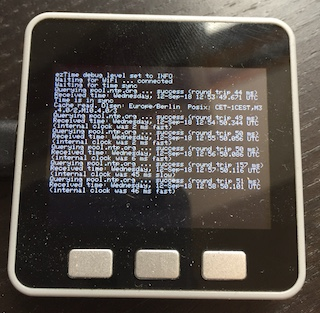

You cannot send debug information to multiple devices at the same time.

&nbsp;

### *error*

`ezError_t error(bool reset = false);`

A number of functions in ezTime are booleans, meaning they return `true` or `false` as their return value, where `false` means some error occurred. `error` will return an `ezError_t` enumeration, something like `NO_NETWORK` (obvious) or `LOCKED_TO_UTC` (when you try to load some new timezone info to the UTC object). You can test for these specific errors and this document will mention which errors might happen in what functions.

When you call `error(true)`, it will also reset the error to `OK`, so you can make sure no new errors happened after a certain point.

&nbsp;

### *errorString*

`String errorString(ezError_t err = LAST_ERROR);`

This will give you a string representation of the error specified. The pseudo-error `LAST_ERROR`, which is the default, will give you the textual representation of the last error. This will not reset the last error stored.

&nbsp;

## Compatibility with Arduino Time library

The classic Arduino time library has a lot of functions and defines that end up in the root namespace, meaning you can just run `hour()` instead of `someTZ.hour()`. These functions are supported by ezTime and will act as if they are prefixed with the defaultTZ. This is UTC by default, but you can make any timezone the default by writing `someTZ.setDefault();`

If you do not wish to have these functions in your namespace, you can comment out `#define ARDUINO_TIMELIB_COMPATIBILITY` in `ezTime.h`. New code depending on ezTime should probably explicitly state the timezone, especially in code with multiple timezones.

&nbsp;

## Smaller footprint, AVR Arduinos

This library compiles on an Arduino Uno with an Ethernet shield. However, it will use up almost all of the flash on that, which is fine if you were making a date and time display anyway. But if your code is bigger than that, you will want to make it smaller. By uncommenting `#define EZTIME_MAX_DEBUGLEVEL_NONE` in `ezTime.h` you get no debugging information and no textual errors, which saves a couple of kilobytes. If you do not use networking, you should also comment out `#define EZTIME_NETWORK_ENABLE`, that will save a *ton* of space: not just in ezTime but also because the networking library does not get loaded.

&nbsp;

## 2036 and 2038

The NTP timestamps used here run until the 7th of February 2036. NTP itself has 128 bits of time precision, I haven't looked into it much. Didn't have to, because just a little later, on the 19th of January 2038, the time_t 32 bit signed integer overflows. This is 20 years from today, in 2018. The Arduino world, if it still exists around then, will have come together around some solution that probably involves 64-bit time like in many operating systems of 2018. If you use this library in your nuclear generating station (**NOOOOO!**), make sure you're not around when these timers wrap around.

Should you be the one doing maintenance on this in some far-ish future: For ezTime I created another overflowing counter: the cache age for the timezone information is written as a single unsigned byte in months after January 2018, so that could theoretically cause problems in 2039, but I think everything will just roll over and use 2039 as the new anchor date.

&nbsp;

## Inspiration

Please do tell me if you made something cool and I'll include it here.

### Arduino clock

Github user [BugerDread](https://github.com/BugerDread) made an [Arduino clock](https://github.com/BugerDread/esp8266-ezTIME-wifi-clock) using ESP8266, ezTIME and MAX7219 LED display modules. It's pretty:

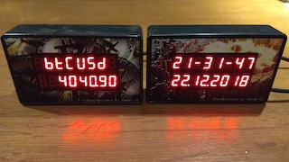

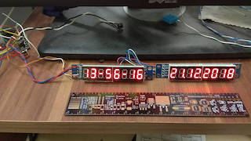

&nbsp;

## ezTime on various Arduino platforms

If your Arduino has anything like normal Arduino networking, we can make it work. In some cases it might take an exception in the code if it needs a special header file or so, but no big deal. And if it has `EEPROM.h` or `Preferences.h` to store things in flash, we can make the cache work too. Please open an issue on [github](htttps://github.com/ropg/ezTime) to tell me if something doesn't work. Here's a list of boards that ezTime has been tested on.

### DSD Tech ESP8266

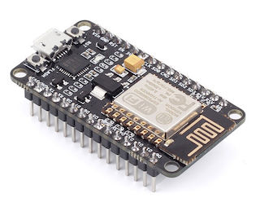

ezTime 0.7.2 ran fine. Board: Generic ESP8266, Reset Method: nodemcu. Don't forget to replace `#include <WiFi.h>` with  `#include <ESP8266WiFi.h>` in your sketch.

&nbsp;

### Teensy 3.2

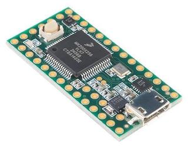

ezTime 0.7.2 ran fine. Did not test networking, so compiled with `#define EZTIME_NETWORK_ENABLE` commented out, used NoNetwork example.

&nbsp;

### Arduino Uno R3 (clone) with Ethernet Shield W5100

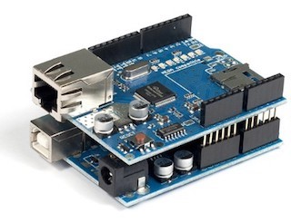

ezTime 0.7.4 ran, the EthernetShield example leaves some 5k of flash:

```
Sketch uses 26536 bytes (82%) of program storage space. Maximum is 32256 bytes.
Global variables use 733 bytes (35%) of dynamic memory, leaving 1315 bytes for local variables. Maximum is 2048 bytes.
```

By setting `#define EZTIME_MAX_DEBUGLEVEL_NONE` in `eztime.h` we can free up some more flash:

```
Sketch uses 23870 bytes (74%) of program storage space. Maximum is 32256 bytes.
Global variables use 729 bytes (35%) of dynamic memory, leaving 1319 bytes for local variables. Maximum is 2048 bytes.
```

ezTime and NoNetwork example without `#define EZTIME_NETWORK_ENABLE` (if you have another time source and are willing to put in the Posix information for timezones yourself.):

```
Sketch uses 11558 bytes (35%) of program storage space. Maximum is 32256 bytes.
Global variables use 354 bytes (17%) of dynamic memory, leaving 1694 bytes for local variables. Maximum is 2048 bytes.
```

&nbsp;

### M5Stack (ESP32)

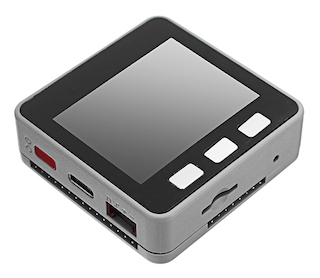

ezTime 0.7.2 ran fine.

&nbsp;

### Arduino Micro

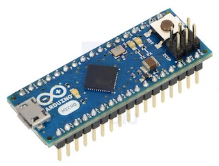

USB took a while to be recognized on my Mac, and then I took a while to discover that this is one that needs the

```
while (!Serial) { ; }		// wait for serial port to connect. Needed for native USB port only
```

line that you see in many sketches. But then ezTime 0.7.2 ran fine using NoNetwork example.

&nbsp;

### Arduino Due

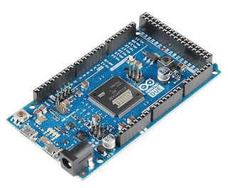

ezTime 0.7.2 runs fine (No networking on board, so tested with NoNetwork example). If you use the native USB port it also needs the `while (!Serial) { ; }` and you need to change all the `Serial.` to `SerialUSB.` in your sketch. Note that if you want debugging info you can pass the SerialUSB port as the second argument to `setDebug`.

&nbsp;

### Arduino MKR1000

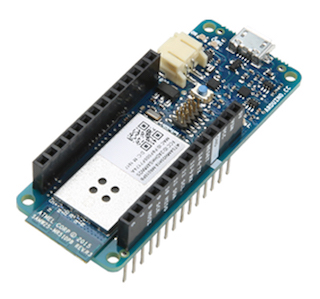

ezTime 0.7.2 worked, eventually. But I didn't like this one. Getting online is difficult. Install Wifi101 library from the library manager and make sure to start your sketch with:

```
#include <SPI.h>
#include <WiFi101.h>
```

* Test sketch complained about WiFi firmware / driver mismatch. Couldn't get the firmware update tool to work, but WiFi worked anyway.
* The WiFi object does not have the `isConnected` method so I wrote some detection for ezTime to skip the NO_NETWORK checks. This means that if you have debug level at ERROR or higher, waitForSync will throw some NTP TIMEOUT errors (and then continue just fine after wifi is online).
* It doesn't have `EEPROM.h` or `Preferences.h` but some proprietary `FlashStorage.h`. So no cache for the moment. (Turn off both cache defines at the beginning of `ezTime.h`. I'll write it if the third person wants it.

&nbsp;

### Arduino Nano

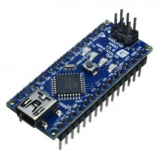

ezTime 0.7.2 runs fine (No networking on board, so tested with NoNetwork example)


&nbsp;

## Table of Contents

   * [ezTime, an Arduino library for all of time <sup>*</sup>](#eztime-an-arduino-library-for-all-of-time-)
      * [A brief history of ezTime](#a-brief-history-of-eztime)
      * [ezTime is ...](#eztime-is-)
         * [Timezones](#timezones)
         * [Formatted date and time](#formatted-date-and-time)
         * [milliseconds](#milliseconds)
         * [Rich information and <em>... oh my just look at these NTP updates</em>](#rich-information-and--oh-my-just-look-at-these-ntp-updates)
      * [Getting started](#getting-started)
   * [ezTime User Manual](#eztime-user-manual)
      * [About this manual](#about-this-manual)
         * [Semi-internal functions](#semi-internal-functions)
         * [Specifying time](#specifying-time)
      * [How it all works](#how-it-all-works)
         * [What happens when you include the library](#what-happens-when-you-include-the-library)
         * [No daemons here](#no-daemons-here)
         * [But I only just woke up !](#but-i-only-just-woke-up-)
      * [Setting and synchronising time](#setting-and-synchronising-time)
         * [timeStatus](#timestatus)
         * [waitForSync](#waitforsync)
         * [<em>setServer and setInterval</em>](#setserver-and-setinterval)
         * [<em>updateNTP</em>](#updatentp)
         * [<em>lastNtpUpdateTime</em>](#lastNtpUpdateTime)
         * [<em>queryNTP</em>](#queryntp)
      * [Timezones](#timezones-1)
         * [setDefault](#setdefault)
         * [setPosix](#setposix)
         * [getPosix](#getposix)
         * [isDST](#isdst)
         * [getTimezoneName](#gettimezonename)
         * [getOffset](#getoffset)
         * [setLocation](#setlocation)
         * [timezoned.rop.nl](#timezoned-rop-nl)
         * [Timezone caching, EEPROM or NVS](#timezone-caching-eeprom-or-nvs)
         * [setCache](#setcache)
         * [clearCache](#clearcache)
         * [Crazy timezones](#crazy-timezones)
            * [Chatham Islands and Nepal](#chatham-islands-and-nepal)
            * [Morocco](#morocco)
      * [Getting date and time](#getting-date-and-time)
         * [dateTime](#datetime)
         * [Built-in date and time formats](#built-in-date-and-time-formats)
         * [Time and date as numbers](#time-and-date-as-numbers)
         * [<em>weekISO and yearISO</em>](#weekiso-and-yeariso)
         * [<em>militaryTZ</em>](#militarytz)
         * [secondChanged and minuteChanged](#secondchanged-and-minutechanged)
         * [names of days and months](#names-of-days-and-months)
         * [different languages](#different-languages)
      * [Events](#events)
         * [events](#events-1)
         * [setEvent](#setevent)
         * [deleteEvent](#deleteevent)
      * [Setting date and time manually](#setting-date-and-time-manually)
         * [setTime](#settime)
         * [Alternate sources of time](#alternate-sources-of-time)
      * [Working with time values](#working-with-time-values)
         * [<em>breakTime</em>](#breaktime)
         * [makeTime](#maketime)
         * [<em>makeOrdinalTime</em>](#makeordinaltime)
         * [<em>compileTime</em>](#compiletime)
         * [<em>tzTime</em>](#tztime)
      * [Various functions](#various-functions)
         * [<em>zeropad</em>](#zeropad)
      * [Errors and debug information](#errors-and-debug-information)
         * [<em>setDebug</em>](#setdebug)
         * [<em>error</em>](#error)
         * [<em>errorString</em>](#errorstring)
      * [Compatibility with Arduino Time library](#compatibility-with-arduino-time-library)
      * [Smaller footprint, AVR Arduinos](#smaller-footprint-avr-arduinos)
      * [2036 and 2038](#2036-and-2038)
      * [Inspiration](#Inspiration)
         * [Arduino clock](#Arduino-clock)
      * [ezTime on various Arduino platforms](#eztime-on-various-arduino-platforms)
         * [DSD Tech ESP8266](#dsd-tech-esp8266)
         * [Teensy 3.2](#teensy-32)
         * [Arduino Uno R3 (clone) with Ethernet Shield W5100](#arduino-uno-r3-clone-with-ethernet-shield-w5100)
         * [M5Stack (ESP32)](#m5stack-esp32)
         * [Arduino Micro](#arduino-micro)
         * [Arduino Due](#arduino-due)
         * [Arduino MKR1000](#arduino-mkr1000)
         * [Arduino Nano](#arduino-nano)
      * [Table of Contents](#table-of-contents)
         * [Function reference](#function-reference)

&nbsp;

### Function reference

| function | returns | arguments | TZ prefix | network | cache |
|:---------|:--------|:----------|:----------|:--------|:------|
| [**`breakTime`**](#breaktime) | `void` | `time_t time`, `tmElements_t &tm` | no | no | no
| [**`clearCache`**](#clearcache) | `void` | `bool delete_section = false` | yes | yes | NVS
| [**`clearCache`**](#clearcache) | `void` | | yes | yes | EEPROM
| [**`compileTime`**](#compiletime) | `time_t` | `String compile_date = __DATE__`, `String compile_time = __TIME__` | no | no | no
| [**`dateTime`**](#datetime) | `String` | `TIME`, `String format = DEFAULT_TIMEFORMAT` | optional | no | no
| [**`day`**](#time-and-date-as-numbers) | `uint8_t` | `TIME` | optional | no | no
| [**`dayOfYear`**](#time-and-date-as-numbers) | `uint16_t` | `TIME` | optional | no | no
| [**`dayShortStr`**](#names-of-days-and-months) | `String` | `uint8_t day` | no | no | no
| [**`dayStr`**](#names-of-days-and-months) | `String` | `uint8_t day` | no | no | no
| [**`deleteEvent`**](#deleteevent) | `void` | `uint8_t event_handle` | no | no | no
| [**`deleteEvent`**](#deleteevent) | `void` | `void (`*function`)(``)` | no | no | no
| [**`error`**](#error) | `ezError_t` | `bool reset = false` | no | no | no
| [**`errorString`**](#errorstring) | `String` | `ezError_t err = LAST_ERROR` | no | no | no
| [**`events`**](#events) | `void` | | no | no | no
| [**`getOffset`**](#getoffset) | `int16_t` | `TIME` | optional | no | no
| **function** | **returns** | **arguments** | **TZ prefix** | **network** | **cache** |
| [**`getOlson`**](#getolson) | `String` | | optional | yes | yes |
| [**`getPosix`**](#getposix) | `String` | | yes | no | no
| [**`getTimezoneName`**](#gettimezonename) | `String` | `TIME` | optional | no | no
| [**`hour`**](#time-and-date-as-numbers) | `uint8_t` | `TIME` | optional | no | no
| [**`hourFormat12`**](#time-and-date-as-numbers) | `uint8_t` | `TIME` | optional | no | no
| [**`isAM`**](#time-and-date-as-numbers) | `bool` | `TIME` | optional | no | no
| [**`isDST`**](#isdst) | `bool` | `TIME` | optional | no | no
| [**`isPM`**](#time-and-date-as-numbers) | `bool` | `TIME` | optional | no | no
| [**`lastNtpUpdateTime`](#lastNtpUpdateTime) | `time_t` | | no | yes | no 
| [**`makeOrdinalTime`**](#makeordinaltime) | `time_t` | `uint8_t hour`, `uint8_t minute`, `uint8_t second`, `uint8_t ordinal`, `uint8_t wday`, `uint8_t month`, `uint16_t year` | no | no | no
| [**`makeTime`**](#maketime) | `time_t` | `tmElements_t &tm` | no | no | no
| [**`makeTime`**](#maketime) | `time_t` | `uint8_t hour`, `uint8_t minute`, `uint8_t second`, `uint8_t day`, `uint8_t month`, `uint16_t year` | no | no | no
| [**`militaryTZ`**](#militarytz) | `String` | `TIME` | optional | no | no
| [**`minute`**](#time-and-date-as-numbers) | `uint8_t` | `TIME` | optional | no | no
| [**`minuteChanged`**](#secondchanged-and-minutechanged) | `bool` | | no | no | no
| [**`month`**](#time-and-date-as-numbers) | `uint8_t` | `TIME` | optional | no | no
| **function** | **returns** | **arguments** | **TZ prefix** | **network** | **cache** |
| [**`monthShortStr`**](#names-of-days-and-months) | `String` | `uint8_t month` | no | no | no
| [**`monthStr`**](#names-of-days-and-months) | `String` | `uint8_t month` | no | no | no
| [**`ms`**](#time-and-date-as-numbers) | `uint16_t` | `TIME_NOW` or `LAST_READ` | optional | no | no
| [**`now`**](#time-and-date-as-numbers) | `time_t` | | optional | no | no
| [**`queryNTP`**](#queryntp) | `bool` | `String server`, `time_t &t`, `unsigned long &measured_at` | no | yes | no
| [**`second`**](#time-and-date-as-numbers) | `uint8_t` | `TIME` | optional | no | no
| [**`secondChanged`**](#secondchanged-and-minutechanged) | `bool` | | no | no | no
| [**`setCache`**](#setcache) | `bool` | `String name`, `String key` | yes | yes | NVS
| [**`setCache`**](#setcache) | `bool` | `int16_t address` | yes | yes | EEPROM
| [**`setDebug`**](#setdebug) | `void` | `ezDebugLevel_t level` | no | no | no
| [**`setDebug`**](#setdebug) | `void` | `ezDebugLevel_t level`, `Print &device` | no | no | no
| [**`setDefault`**](#setdefault) | `void` | | yes | no | no
| [**`setEvent`**](#setevent) | `uint8_t` | `void (*function)()`, `TIME` | optional | no | no
| [**`setEvent`**](#setevent) | `uint8_t` | `void (*function)()`, `uint8_t hr`, `uint8_t min`, `uint8_t sec`, `uint8_t day`, `uint8_t mnth`, `uint16_t yr` | optional | no | no
| [**`setInterval`**](#setserver-and-setinterval) | `void` | `uint16_t seconds = 0` |  | yes | no
| **function** | **returns** | **arguments** | **TZ prefix** | **network** | **cache** |
| [**`setLocation`**](#setlocation) | `bool` | `String location = ""` | yes | yes | no
| [**`setPosix`**](#setposix) | `bool` | `String posix` | yes | yes | no
| [**`setServer`**](#setserver-and-setinterval) | `void` | `String ntp_server = NTP_SERVER` | no | yes | no
| [**`setTime`**](#settime) | `void` | `time_t t`, `uint16_t ms = 0` | optional | no | no
| [**`setTime`**](#settime) | `void` | `uint8_t hr`, `uint8_t min`, `uint8_t sec`, `uint8_t day`, `uint8_t mnth`, `uint16_t yr` | optional | no | no
| [**`timeStatus`**](#timestatus) | `timeStatus_t` | | no | no | no
| [**`tzTime`**](#tztime) | `time_t` | `TIME` | yes | no | no
| [**`tzTime`**](#tztime) | `time_t` | `TIME`, `String &tzname`, `bool &is_dst`, `int16_t &offset` | yes | no | no
| [**`updateNTP`**](#updatentp) | `void` | | no | yes | no
| [**`waitForSync`**](#waitforsync) | `bool` | `uint16_t timeout = 0` | no | yes | no
| [**`weekISO`**](#weekiso-and-yeariso) | `uint8_t` | `TIME` | optional | no | no
| [**`weekday`**](#time-and-date-as-numbers) | `uint8_t` | `TIME` | optional | no | no
| [**`year`**](#time-and-date-as-numbers) | `uint16_t` | `TIME` | optional | no | no
| [**`yearISO`**](#weekiso-and-yeariso) | `uint16_t` | `TIME` | optional | no | no
| [**`zeropad`**](#zeropad) | `String` | `uint32_t number`, `uint8_t length` | no | no | no 